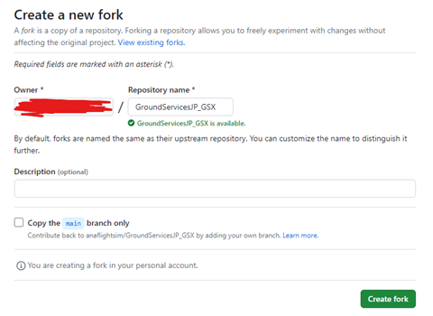
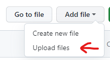
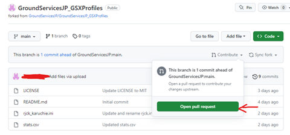

# GroundServicesJP
## 概要 Overview
GroundServicesJP “GSJP”は、MicrosoftFlightSimulatorでの日本国内における空港の地上サービスや設備(GSE)を再現するために開始されたプロジェクトで、github.comを拠点とするオープンソースプロジェクトです。 

GSJPプロジェクトの4つの目標：  
1. 空港車両の配置、乗客の乗降経路設定、プッシュバック位置の設定、機体の停止位置設定をGSX Pro用プロファイルとして作成する (MSFS限定の機能) 。  
2. GSXを使用せずにプッシュバックをする方など、全ユーサー向けのプッシュバックマップを作成する。  
3. github.comのプロジェクトページを訪問することなく、GSJPにて作成されたプロファイルのダウンロードやアップデートを行えるソフトウェアの開発を行う(実装までしばらくお待ち下さい)。  
4. GSXの空港車両などを現実の塗装に合わせる(実装までしばらくお待ち下さい)。 

GroundServicesJP (GSJP) aims to improve Ground Services Equipment (GSE) in Japan on MSFS. The open-sourced project is hosted on github.com.  

The project has four objectives:  
1. GSX Pro profiles that include correct positioning of GSE vehicles, PAX Waypoints, pushback/stop locations. This feature is for MSFS only.  
2. Pushback maps for all users (including ones who do not use GSX).  
3. A software that organizes and updates various GSX profiles, so users do not have to come to github and download releases. This feature will come later.  
4. Updated GSX GSE vehicle textures to reflect the real condition. This feature will come later.

## GSX Profiles
### Githubリポジトリへのリンク  Repository Link
https://github.com/GroundServicesJP/GroundServicesJP_GSXProfiles

### 必要アドオン Required Environment
- Microsoft Flight Simulator (MSFS 2020) 
- FSDreamTeam GSX Pro.  
- GSXプロファイルがサポートする空港アドオン Addon Airports the GSX profiles are supporting.

### ダウンロードとインストール  Download and Installation
現時点では、 https://github.com にあるファイルをダウンロードし、以下の手順でインストールしてください。  

1. GSXProのプロファイル(.ini) をインストールするため、`%AppData%\Virtuali\GSX\MSFS`を開きます。  

2. 同じ空港の古いプロファイル（自動生成されたプロファイル、ご自身で作成されたプロファイルなど）が既に存在している場合は、バックアップのうえ削除してください。  

3. `.ini`ファイルを `%AppData%\Virtuali\GSX\MSFS` にペーストしてください。  

※`.ini`ファイル内のAFCAD.bglの書き込み欄は空欄のままで問題ありません。 

Currently, please download the newest release on https://github.com. To install the files, follow these steps:  
1. Move the .ini files to the folder at `%AppData%\Virtuali\GSX\MSFS`. 
2. If you have old configuration files for the airport (either autogenerated, provided by us, or other creators), please backup and delete.  
3. Move the `.ini` files to the folder. There is no need to change AFCAD `.bgl` file path for MSFS GSX Pro version.

### サポートされている空港とProfileバージョン  Supported Airports and Version
| プロファイル名 Profile Name▼ | 空港 Airport           | シーナリー作者 Scenery Creator | バージョン Version | リリース日 Release Date |
| -----------                | -----------           | -----------                   | -----------                    | ----------- |
| rjcb-alois.ini/.py          | 帯広 Obihiro (RJCB)   | Mr.Alois                      | Ver 1.0                       | 2024/02/17 |
| rjck-karuchie.ini/.py          | 釧路 Kushiro (RJCK)   | Mr.karuchie                      | Ver 1.1                       | 2024/02/03 |
| rjfr-mfsg.ini              | 北九州 Kitakyushu (RJFR) | MFSG                          | Ver 1.0                        | 2024/01/28 |
| rjsk-fssa.ini/.py              | 秋田 Akita (RJSK) | FSSA                          | Ver 1.1                           | 2024/02/03 |
| rjsr-highmemfix.ini/.py              | 大館能代 Odate-Noshiro (RJSR) | Highmemfix                          | Ver 1.0                           | 2024/02/17 |
| rjth-karuchie.ini/.py            | 八丈島 Hachijojima (RJTH) | Mr.karuchie                         | Ver 1.0                             | 2024/02/17 |
| rjoa-kaze.ini/.py              | 広島 Hiroshima (RJOA) | Mr.KAZE                          | Ver 1.1                       | 2024/02/03 |
| rjoo-kado.ini/.py            | 大阪国際 Osaka International (RJOO) | Mr.KADO                         | Ver 1.1            | 2024/02/03 |
| rjok-mfsg.ini/.py            | 高知 Kochi (RJOK) | MFSG                         | Ver 1.0                             | 2024/02/17 |
| roig-keisim.ini/.py            | 新石垣 New Ishigaki (ROIG) | Mr.Keisim                          | Ver 1.1                | 2024/02/03 |

### ライセンス Licensing 
GSJPプロジェクトのライセンスは、Githubリポジトリ内の `LICENSE.md` をご覧ください。  
Please refer to LICENSE.md on github.com in the github repository.  

### プロジェクトへの参加 Contributing
GSJPプロジェクトへ加入されたい方は、github.comにてリポジトリをForkし、Pull Request(PR)を作成してください。 

以下は、git VCSを使用せずにgithub.comでプロジェクトに参加するための簡単なフローです。 

Github.com内にて公開されているProfileを更新する、あるいは作成したProfileをアップロードする場合: 

If you would like to contribute, please fork the repository and make a pull request (PR).  

Here is a simple procedure on how to contribute on github without git VCS.  If you would like to add or edit an existing .ini file:  
1. リポジトリ (Repository) をForkする。Fork the repository.
   
   
2. ファイルアップロードを選択し、更新したファイルをアップロードする。この際、必ず自身のForkしたリポジトリ内で作業を行ってください。Have your edited file ready, select Upload files and upload. Make sure you are doing this in your own forked repository.
   
   
3. アップロードが完了したら、Pull Request(PR)を作成します。 Create a Pull Request (PR) after committing.
   
   
4. PRが、下の画像のように正しく設定されていることを確認してください。  Make sure the PR is set up correctly. Make sure the head repository is your repository and the branch for comparing contains files you would like to add/edit. Make sure the base repository is GroundServicesJP/GroundServicesJP_GSXProfiles and the base branch is main. Create the pull request and we will review it.
   
  

※ あなたが作成したファイルをgithubを通してアップロードできない場合、GSJPプロジェクトメンバーに直接ファイルを送っていただければ、プロジェクトメンバーが代理でアップロードを行い、更新の連絡を行います。 If you do not want to use github.com, please send us the files directly, and we will review and update them for you.

### プロジェクトメンバー Contributor List 
- ANA7875 (@ANA7875_fwc) 
- ろくまる (@60Kumaru)
- Sanrok (@sanrok_)
- RIN
